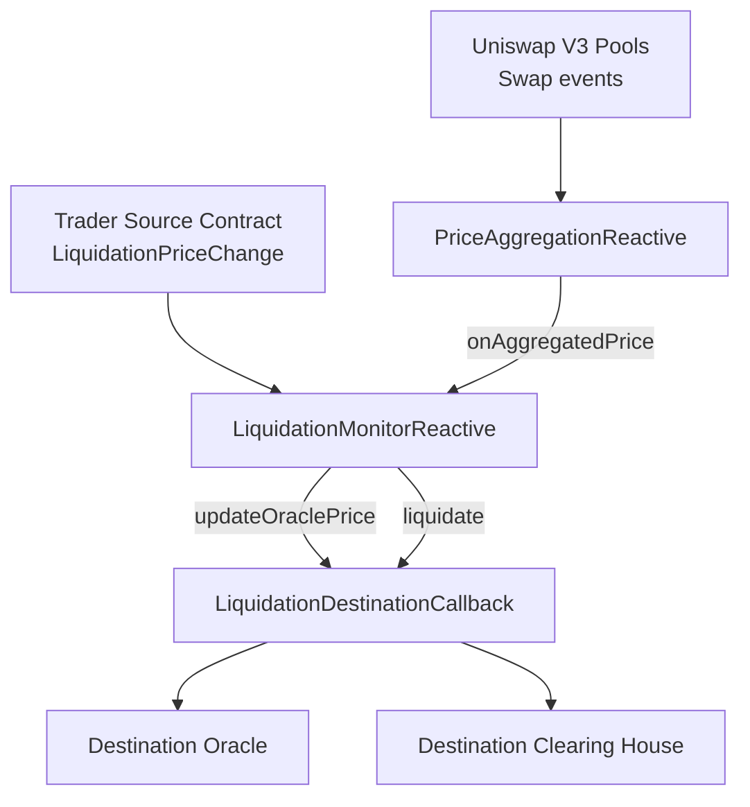

# Oracle Aggregation

Event-driven oracle aggregation and liquidation automation built for the Reactive Network.

The current codebase focuses on:

- a V3-only price aggregator that listens to Uniswap V3 `Swap` events across chains
- a liquidation monitor that tracks trader liquidation thresholds
- a destination callback that updates the destination oracle and triggers liquidation callbacks

## Architecture

```text
+------------------------------------------------------------+
| Uniswap V3 Pools                                           |
| Ethereum / Base / ...                                      |
| Event: Swap(address,address,int256,int256,uint160,uint128,int24) |
+------------------------------------------------------------+
                             |
                             v
+------------------------------------------------------------+
| PriceAggregationReactive                                   |
| - normalize per-pool tick direction                        |
| - maintain per-pool tick cumulative                        |
| - compute weighted aggregate price                         |
+------------------------------------------------------------+
                             |
                             | Callback: onAggregatedPrice(address,uint256,uint256)
                             v
+------------------------------------------------------------+
| LiquidationMonitorReactive                                 |
| - track trader liquidation thresholds                      |
| - compare liquidationPrice vs aggregate price              |
| - emit destination callbacks                               |
+------------------------------------------------------------+
             ^                                       |
             |                                       |
             | LiquidationPriceChange(address,uint256,bool)
             |                                       | Callback: updateOraclePrice(uint256)
+-------------------------------+                    | Callback: liquidate(address)
| Trader Source Contract        |                    v
+-------------------------------+  +--------------------------------------------------+
                                  | LiquidationDestinationCallback                    |
                                  | - update destination oracle                      |
                                  | - call destination clearing house liquidation    |
                                  +--------------------------------------------------+
```



## Contracts

### `PriceAggregationReactive`

File: [src/PriceAggregationReactive.sol](/Users/perfogic/Workspace/Evm/oracle-aggregation/src/PriceAggregationReactive.sol)

Responsibilities:

- subscribes to multiple Uniswap V3 pools
- normalizes each pool into a common price direction using:
  - `token0Decimals`
  - `token1Decimals`
  - `useQuoteAsBase`
- maintains per-pool `tick cumulative`
- computes weighted aggregate price across active pools
- emits a callback when the aggregate price changes

Notes:

- `activePools` means a pool has started producing data
- `ready` means every configured pool has enough history for the configured TWAP interval
- timestamps are taken from the Reactive execution environment, not from the source chain block timestamp

### `LiquidationMonitorReactive`

File: [src/LiquidationMonitorReactive.sol](/Users/perfogic/Workspace/Evm/oracle-aggregation/src/LiquidationMonitorReactive.sol)

Responsibilities:

- subscribes to `LiquidationPriceChange(address,uint256,bool)` from the trader source contract
- stores trader liquidation thresholds
- receives aggregate price updates from `PriceAggregationReactive`
- emits destination callbacks for:
  - `updateOraclePrice(uint256)`
  - `liquidate(address)`
- removes a trader when the source emits:
  - `LiquidationPriceChange(trader, 0, true)`

Semantics:

- liquidation is requested when `liquidationPriceE18 > currentPriceE18`
- `sourceContract` and `priceAggregationContract` are intentionally different trust boundaries:
  - `sourceContract` emits trader threshold updates
  - `priceAggregationContract` is the only contract allowed to call `onAggregatedPrice(...)`

### `LiquidationDestinationCallback`

File: [src/LiquidationDestinationCallback.sol](/Users/perfogic/Workspace/Evm/oracle-aggregation/src/LiquidationDestinationCallback.sol)

Responsibilities:

- receives authorized callbacks from the Reactive side
- forwards `updateOraclePrice(uint256)` to the destination oracle
- forwards `liquidate(address)` to the destination clearing house

## Price Model

The aggregator stores `tick cumulative`, not direct price cumulative.

Per pool:

- Uniswap V3 `Swap` events provide the latest `tick`
- the contract accumulates `tick * dt`
- a TWAP tick is derived over the configured interval
- that tick is converted into a normalized `priceE18`

For aggregation:

- only initialized pools are included in the aggregate
- weights come from `PoolConfig.weight`
- if some pools are active but not yet warm enough for the interval, the contract still returns a price using fallback latest-tick semantics, while `ready` stays `false`

## Current Deployment Defaults

The Hardhat deploy script for the aggregator is preloaded with two pools:

- Ethereum mainnet pool
  - `sourceChainId = 1`
  - `pool = 0x4e68Ccd3E89f51C3074ca5072bbAC773960dFa36`
  - `token0Decimals = 18`
  - `token1Decimals = 6`
  - `useQuoteAsBase = false`
  - `weight = 50`
- Base pool
  - `sourceChainId = 8453`
  - `pool = 0x6c561B446416E1A00E8E93E221854d6eA4171372`
  - `token0Decimals = 18`
  - `token1Decimals = 6`
  - `useQuoteAsBase = false`
  - `weight = 50`

Mainnet and testnet network params in the current Hardhat config:

- Reactive Mainnet
  - RPC: `https://mainnet-rpc.rnk.dev/`
  - Chain ID: `1597`
  - Explorer: `https://reactscan.net/`
- Reactive Lasna
  - RPC: `https://lasna-rpc.rnk.dev/`
  - Chain ID: `5318007`
  - Explorer: `https://lasna.reactscan.net`

## Tooling

This repo uses:

- Foundry for Solidity testing
- Hardhat 3 + TypeScript for deployment scripting
- `@nomicfoundation/hardhat-foundry` so Hardhat can resolve Foundry-style remappings and `lib/` dependencies

## Install

```bash
forge --version
npm install
```

## Test

Foundry is the primary test runner.

```bash
forge test
```

Useful targeted test runs:

```bash
forge test --match-path test/PriceAggregationReactive.t.sol
forge test --match-path test/FullFlow.t.sol
```

Hardhat compile is also wired up and useful for deploy-script validation:

```bash
npx hardhat compile
```

## Deploy

### Deploy `PriceAggregationReactive`

Script: [scripts/deploy-price-aggregation.ts](/Users/perfogic/Workspace/Evm/oracle-aggregation/scripts/deploy-price-aggregation.ts)

Required env:

```bash
export PRIVATE_KEY=...
export CALLBACK_TARGET=0xYourMonitor
```

Optional env:

```bash
export DEFAULT_INTERVAL=900
export CALLBACK_CHAIN_ID=1597
export CALLBACK_GAS_LIMIT=400000
export DEPLOY_VALUE_WEI=0
```

Deploy to Reactive Mainnet:

```bash
npx hardhat run scripts/deploy-price-aggregation.ts --network reactiveMainnet
```

Deploy to Lasna:

```bash
npx hardhat run scripts/deploy-price-aggregation.ts --network lasna
```

### Deploy full liquidation stack

Script: [scripts/deploy-liquidation-stack.ts](/Users/perfogic/Workspace/Evm/oracle-aggregation/scripts/deploy-liquidation-stack.ts)

Required env:

```bash
export PRIVATE_KEY=...
export TRADER_SOURCE_CHAIN_ID=8453
export TRADER_SOURCE_CONTRACT=0xYourTraderSource
export REACTIVE_CHAIN_ID=1597
```

Optional env:

```bash
export DEFAULT_INTERVAL=900
export AGGREGATOR_CALLBACK_GAS_LIMIT=400000
export LIQUIDATION_EXECUTOR_GAS_LIMIT=300000
export EXECUTOR_CALLBACK_SENDER=0x0000000000000000000000000000000000fffFfF
export DEPLOY_VALUE_WEI=0
```

Deploy:

```bash
npx hardhat run scripts/deploy-liquidation-stack.ts --network reactiveMainnet
```

## Important Operational Notes

- `ready = false` does not mean the aggregator is broken.
  It means at least one pool has not accumulated enough history for the configured TWAP interval.
- `activePools = N` does not imply `ready = true`.
  A pool becomes active on first observation, but only becomes ready after enough time has elapsed.
- same-second burst swaps can happen on active pools.
  The oracle library now overwrites the latest tick for zero-delta timestamps instead of reverting.
- the liquidation monitor no longer depends on a destination-side success subscription to remove users.
  Trader removal is driven by the source-side `LiquidationPriceChange(trader, 0, true)` event.

## Repository Layout

- [src/PriceAggregationReactive.sol](/Users/perfogic/Workspace/Evm/oracle-aggregation/src/PriceAggregationReactive.sol)
- [src/LiquidationMonitorReactive.sol](/Users/perfogic/Workspace/Evm/oracle-aggregation/src/LiquidationMonitorReactive.sol)
- [src/LiquidationDestinationCallback.sol](/Users/perfogic/Workspace/Evm/oracle-aggregation/src/LiquidationDestinationCallback.sol)
- [src/twap/TickCumulativeOracleLib.sol](/Users/perfogic/Workspace/Evm/oracle-aggregation/src/twap/TickCumulativeOracleLib.sol)
- [test/PriceAggregationReactive.t.sol](/Users/perfogic/Workspace/Evm/oracle-aggregation/test/PriceAggregationReactive.t.sol)
- [test/FullFlow.t.sol](/Users/perfogic/Workspace/Evm/oracle-aggregation/test/FullFlow.t.sol)
