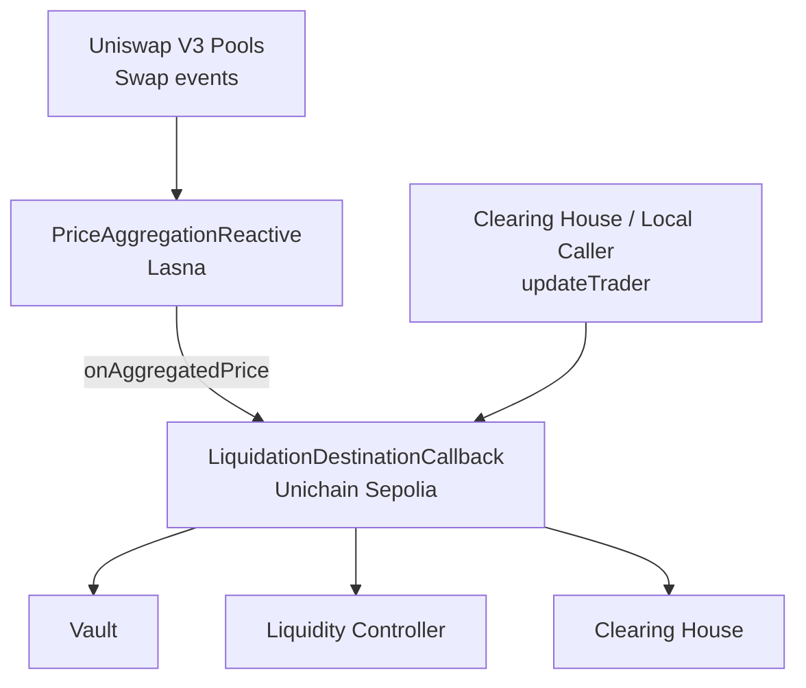

# Oracle Aggregation

Event-driven oracle aggregation and liquidation automation built for the Reactive Network.

The current codebase focuses on:

- a V3-only price aggregator that listens to Uniswap V3 `Swap` events across chains
- a destination callback contract on Unichain that stores trader liquidation thresholds
- a direct callback path from the aggregator into the destination liquidation contract

## Architecture

```text
+------------------------------------------------------------+
| Uniswap V3 Pools                                           |
| Ethereum / Base / Sepolia / ...                            |
| Event: Swap(address,address,int256,int256,uint160,uint128,int24) |
+------------------------------------------------------------+
                             |
                             v
+------------------------------------------------------------+
| PriceAggregationReactive                                   |
| Lasna                                                      |
| - normalize per-pool tick direction                        |
| - maintain per-pool tick cumulative                        |
| - compute weighted aggregate price                         |
+------------------------------------------------------------+
                             |
                             | Callback: onAggregatedPrice(address,address,uint256,uint256)
                             v
+------------------------------------------------------------+
| LiquidationDestinationCallback                             |
| Unichain Sepolia                                           |
| - verify trusted aggregator                                |
| - store latestOraclePriceE18                               |
| - track liquidationPriceE18 per trader                     |
| - optionally call liquidity controller                     |
| - liquidate through clearing house when vault says so      |
+------------------------------------------------------------+
             ^
             |
             | updateTrader(address,uint256,bool)
+-------------------------------+
| Clearing House / Local Caller |
+-------------------------------+
```



## Contracts

### `PriceAggregationReactive`

File: [src/PriceAggregationReactive.sol](/Users/perfogic/Workspace/Evm/oracle-aggregation/src/PriceAggregationReactive.sol)

Responsibilities:

- subscribes to multiple Uniswap V3 pools
- normalizes each pool into a common price direction using:
  - `token0Decimals`
  - `token1Decimals`
  - `useQuoteAsBase`
- maintains per-pool `tick cumulative`
- computes weighted aggregate price across active pools
- emits a direct callback to the Unichain destination callback contract when the aggregate price changes

Notes:

- `activePools` means a pool has started producing data
- `ready` means every configured pool has enough history for the configured TWAP interval
- timestamps are taken from the Reactive execution environment, not from the source chain block timestamp

### `LiquidationDestinationCallback`

File: [src/LiquidationDestinationCallback.sol](/Users/perfogic/Workspace/Evm/oracle-aggregation/src/LiquidationDestinationCallback.sol)

Responsibilities:

- receives authorized callbacks from the Reactive callback proxy on Unichain
- verifies the trusted aggregator encoded in the callback payload
- stores `latestOraclePriceE18`
- stores tracked traders and their `liquidationPriceE18`
- optionally calls `liquidityControllerContract.updateFromOracle()`
- checks `vaultContract.isLiquidatable(trader)`
- calls `clearingHouseContract.liquidate(trader)` and removes fully liquidated traders

Key entrypoints:

- `updateTrader(address trader, uint256 liquidationPrice, bool isLiquidated)`
  - called by the configured clearing house
  - updates or removes tracked traders
- `onAggregatedPrice(address rvmId, address aggregator, uint256 currentPriceE18, uint256 activePools)`
  - called through the Reactive callback proxy
  - updates `latestOraclePriceE18`
  - optionally reprices through the liquidity controller
  - scans tracked traders and liquidates when the vault says they are liquidatable

Supporting mocks and interfaces:

- [src/mocks/MockClearingHouse.sol](/Users/perfogic/Workspace/Evm/oracle-aggregation/src/mocks/MockClearingHouse.sol)
- [src/interfaces/IVammClearingHouse.sol](/Users/perfogic/Workspace/Evm/oracle-aggregation/src/interfaces/IVammClearingHouse.sol)
- [src/interfaces/IVammVault.sol](/Users/perfogic/Workspace/Evm/oracle-aggregation/src/interfaces/IVammVault.sol)
- [src/interfaces/IVammLiquidityController.sol](/Users/perfogic/Workspace/Evm/oracle-aggregation/src/interfaces/IVammLiquidityController.sol)

## Price Model

The aggregator stores `tick cumulative`, not direct price cumulative.

Per pool:

- Uniswap V3 `Swap` events provide the latest `tick`
- the contract accumulates `tick * dt`
- a TWAP tick is derived over the configured interval
- that tick is converted into a normalized `priceE18`

For aggregation:

- only initialized pools are included in the aggregate
- weights come from `PoolConfig.weight`
- if some pools are active but not yet warm enough for the interval, the contract still returns a price using fallback latest-tick semantics, while `ready` stays `false`

## Current Deployment Defaults

The Hardhat deploy script for the aggregator is preloaded with two pools:

- Ethereum mainnet pool
  - `sourceChainId = 1`
  - `pool = 0x4e68Ccd3E89f51C3074ca5072bbAC773960dFa36`
  - `token0Decimals = 18`
  - `token1Decimals = 6`
  - `useQuoteAsBase = false`
  - `weight = 50`
- Base pool
  - `sourceChainId = 8453`
  - `pool = 0x6c561B446416E1A00E8E93E221854d6eA4171372`
  - `token0Decimals = 18`
  - `token1Decimals = 6`
  - `useQuoteAsBase = false`
  - `weight = 50`

Mainnet and testnet network params in the current Hardhat config:

- Reactive Mainnet
  - RPC: `https://mainnet-rpc.rnk.dev/`
  - Chain ID: `1597`
  - Explorer: `https://reactscan.net/`
- Reactive Lasna
  - RPC: `https://lasna-rpc.rnk.dev/`
  - Chain ID: `5318007`
  - Explorer: `https://lasna.reactscan.net`
- Unichain Sepolia
  - RPC: `https://sepolia.unichain.org`
  - Chain ID: `1301`

## Tooling

This repo uses:

- Foundry for Solidity testing
- Hardhat 3 + TypeScript for deployment scripting
- `@nomicfoundation/hardhat-foundry` so Hardhat can resolve Foundry-style remappings and `lib/` dependencies

## Install

```bash
forge --version
npm install
```

## Test

Foundry is the primary test runner.

```bash
forge test
```

Useful targeted test runs:

```bash
forge test --match-path test/PriceAggregationReactive.t.sol
forge test --match-path test/FullFlow.t.sol
```

Hardhat compile is also wired up and useful for deploy-script validation:

```bash
npx hardhat compile
```

## Deploy

### Deploy `PriceAggregationReactive`

Script: [scripts/deploy-price-aggregation.ts](/Users/perfogic/Workspace/Evm/oracle-aggregation/scripts/deploy-price-aggregation.ts)

Required env:

```bash
export PRIVATE_KEY=...
export CALLBACK_TARGET=0xYourDestinationCallback
```

Optional env:

```bash
export DEFAULT_INTERVAL=900
export CALLBACK_CHAIN_ID=1597
export CALLBACK_GAS_LIMIT=400000
export DEPLOY_VALUE_WEI=0
```

Deploy to Reactive Mainnet:

```bash
npx hardhat run scripts/deploy-price-aggregation.ts --network reactiveMainnet
```

Deploy to Lasna:

```bash
npx hardhat run scripts/deploy-price-aggregation.ts --network lasna
```

### Deploy full liquidation flow

Script: [scripts/deploy-full-flow.ts](/Users/perfogic/Workspace/Evm/oracle-aggregation/scripts/deploy-full-flow.ts)

This script deploys:

1. `LiquidationDestinationCallback` on Unichain Sepolia
2. `MockClearingHouse` on Unichain Sepolia
3. sets `destination.clearingHouseContract`
4. `PriceAggregationReactive` on Lasna
5. sets `destination.trustedAggregator`

Required env:

```bash
export PRIVATE_KEY=...
```

Optional env:

```bash
export DEPLOY_VALUE_WEI=0
```

Deploy:

```bash
npx hardhat run scripts/deploy-full-flow.ts
```

### Update destination addresses

Set `clearingHouseContract` on Unichain:

Script: [scripts/set-clearing-house.ts](/Users/perfogic/Workspace/Evm/oracle-aggregation/scripts/set-clearing-house.ts)

```bash
npx hardhat run scripts/set-clearing-house.ts -- 0xDestination 0xClearingHouse
```

Set `liquidityControllerContract` on Unichain:

Script: [scripts/set-liquidity-controller.ts](/Users/perfogic/Workspace/Evm/oracle-aggregation/scripts/set-liquidity-controller.ts)

```bash
npx hardhat run scripts/set-liquidity-controller.ts -- 0xDestination 0xLiquidityController
```

## Important Operational Notes

- `ready = false` does not mean the aggregator is broken.
  It means at least one pool has not accumulated enough history for the configured TWAP interval.
- `activePools = N` does not imply `ready = true`.
  A pool becomes active on first observation, but only becomes ready after enough time has elapsed.
- same-second burst swaps can happen on active pools.
  The oracle library now overwrites the latest tick for zero-delta timestamps instead of reverting.
- the first callback argument is overwritten by Reactive with the `rvmId`.
  If you need the source aggregator address, reserve the first arg and pass the aggregator address as the second arg.
- callback destination contracts must be funded on the destination chain and may need `coverDebt()` depending on callback execution state.

## Repository Layout

- [src/PriceAggregationReactive.sol](/Users/perfogic/Workspace/Evm/oracle-aggregation/src/PriceAggregationReactive.sol)
- [src/LiquidationDestinationCallback.sol](/Users/perfogic/Workspace/Evm/oracle-aggregation/src/LiquidationDestinationCallback.sol)
- [src/mocks/MockClearingHouse.sol](/Users/perfogic/Workspace/Evm/oracle-aggregation/src/mocks/MockClearingHouse.sol)
- [src/twap/TickCumulativeOracleLib.sol](/Users/perfogic/Workspace/Evm/oracle-aggregation/src/twap/TickCumulativeOracleLib.sol)
- [test/PriceAggregationReactive.t.sol](/Users/perfogic/Workspace/Evm/oracle-aggregation/test/PriceAggregationReactive.t.sol)
- [test/FullFlow.t.sol](/Users/perfogic/Workspace/Evm/oracle-aggregation/test/FullFlow.t.sol)
